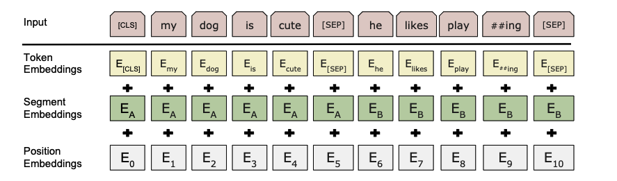

# BERT

## 论文阅读

**B**idirectional **E**ncoder **R**epresentations from **T**ransformers

[BERT: Pre-training of Deep Bidirectional Transformers for Language Understanding](https://arxiv.org/abs/1810.04805)

[官方代码库](https://github.com/google-research/bert)

论文发布时间（2018）在GPT和GPT2发布之间

做NLP两种策略

feature-base:ELMo
对于每一个下游任务，构造一个跟任务相关的神经网络（RNN），
预训练好的表示作为额外的特征和输入一起进入模型，使得模型训练起来会较为容易

fine-tuning:GPT

这两种方法使用相同的目标函数，使用单向的语言模型来学习

作者认为单向语言模型有所限制，提出从两个方向来理解下上文，使用masked language model，
每次随机选择一些词元掩蔽住，预测掩蔽的词元（完形填空）；还使用一个next sentence prediction任务

每个下游任务都会用预训练好的BERT权重，对所用参数进行微调，虽然在CV领域中十分常见，但在NLP领域中以往并未取得很好的效果

直接把Transformer Encoder拿来用了，训练了两个模型BERT-BASE（Transformer Encoder个数L=12，num_hiddens H=768，多头注意力头的个数A=12，总参数个数110M）
和BERT-LARGE（L=24，H=1024，A=16，参数340M）

BERT输入可以是一个句子（连续文本）和两个句子，并成一个序列

使用WordPiece embeddings（如果一个词出现概率不大，切开看词的子序列），30000 token vocabulary

输入Embedding，每个输入序列有个\<CLS\>，句子分隔\<SEP\>，把三个Embedding相加作为input


Mask language model中由wordPiece embedding生成的token有15%的概率变为[MASK]
由于在微调过程中[MASK] token不会出现，因此在训练过程中，这15%的tokens有 (1)80%变为[MASK]
(2)10%变成一个随机token (3)10%不变 （这里的参数都是试出来效果较好）

## 模型代码

参考李沐的d2l对应章节

### 输入表示

把两个句子变成BERT的输入

```python
def get_tokens_and_segments(tokens_a, tokens_b=None):
    """获取输入序列的词元及其片段索引"""
    tokens = ['<cls>'] + tokens_a + ['<sep>']
    # 0和1分别标记片段A和B
    segments = [0] * (len(tokens_a) + 2)
    if tokens_b is not None:
        tokens += tokens_b + ['<sep>']
        segments += [1] * (len(tokens_b) + 1)
    return tokens, segments
```

与Transformer相比，BERT Encoder使用了segment embedding 以及可学习的position embedding(随机初始化)。

```python
class BERTEncoder(nn.Module):
    def __init__(self, vocab_size, num_hiddens, norm_shape, ffn_num_input,
                 ffn_num_hiddens, num_heads, num_layers, dropout,
                 max_len=1000, key_size=768, query_size=768, value_size=768,
                 **kwargs):
        super(BERTEncoder, self).__init__(**kwargs)
        self.token_embedding = nn.Embedding(vocab_size, num_hiddens)
        self.segment_embedding = nn.Embedding(2, num_hiddens)
        self.blks = nn.Sequential()
        for i in range(num_layers):
            self.blks.add_module(f"{i}", d2l.EncoderBlock(
                key_size, query_size, value_size, num_hiddens, norm_shape,
                ffn_num_input, ffn_num_hiddens, num_heads, dropout, True))
        # 在BERT中，位置嵌入是可学习的，因此我们创建一个足够长的位置嵌入参数
        self.pos_embedding = nn.Parameter(torch.randn(1, max_len,
                                                      num_hiddens))

    def forward(self, tokens, segments, valid_lens):
        # 在以下代码段中，X的形状保持不变：（批量大小，最大序列长度，num_hiddens）
        X = self.token_embedding(tokens) + self.segment_embedding(segments)
        X = X + self.pos_embedding.data[:, :X.shape[1], :]
        for blk in self.blks:
            X = blk(X, valid_lens)
        return X
```

实例化encoder

```python
vocab_size, num_hiddens, ffn_num_hiddens, num_heads = 10000, 768, 1024, 4
norm_shape, ffn_num_input, num_layers, dropout = [768], 768, 2, 0.2
encoder = BERTEncoder(vocab_size, num_hiddens, norm_shape, ffn_num_input,
                      ffn_num_hiddens, num_heads, num_layers, dropout)
tokens = torch.randint(0, vocab_size, (2, 8))
segments = torch.tensor([[0, 0, 0, 0, 1, 1, 1, 1], [0, 0, 0, 1, 1, 1, 1, 1]])
encoded_X = encoder(tokens, segments, None)
encoded_X.shape
```

```text
torch.Size([2, 8, 768])
```

输出就是(batch_size,句子长度,num_hiddens)

### Masked Language Modeling

BERT随机掩蔽词元并使用上下文的词元用自监督的方式来预测掩蔽的词元

```python
class MaskLM(nn.Module):
    """BERT的掩蔽语言模型任务"""
    def __init__(self, vocab_size, num_hiddens, num_inputs=768, **kwargs):
        super(MaskLM, self).__init__(**kwargs)
        self.mlp = nn.Sequential(nn.Linear(num_inputs, num_hiddens),
                                 nn.ReLU(),
                                 nn.LayerNorm(num_hiddens),
                                 nn.Linear(num_hiddens, vocab_size))

    def forward(self, X, pred_positions):
        num_pred_positions = pred_positions.shape[1]
        pred_positions = pred_positions.reshape(-1)
        batch_size = X.shape[0]
        batch_idx = torch.arange(0, batch_size)
        # 假设batch_size=2，num_pred_positions=3
        # 那么batch_idx是np.array（[0,0,0,1,1,1]）
        batch_idx = torch.repeat_interleave(batch_idx, num_pred_positions)
        masked_X = X[batch_idx, pred_positions]
        masked_X = masked_X.reshape((batch_size, num_pred_positions, -1))
        mlm_Y_hat = self.mlp(masked_X)
        return mlm_Y_hat
```

实例化

```python
mlm = MaskLM(vocab_size, num_hiddens)
mlm_positions = torch.tensor([[1, 5, 2], [6, 1, 5]])
#batch_size为2，第一个batch希望预测第1，5，2个词元
mlm_Y_hat = mlm(encoded_X, mlm_positions)
mlm_Y_hat.shape
```

```text
torch.Size([2, 3, 10000])
```

输出的形状的就是(batch_size,预测的mask词元个数,vocab_size)

算loss

```python
mlm_Y = torch.tensor([[7, 8, 9], [10, 20, 30]])
loss = nn.CrossEntropyLoss(reduction='none')
mlm_l = loss(mlm_Y_hat.reshape((-1, vocab_size)), mlm_Y.reshape(-1))
```

mlm_l的size为[6]

### Next Sentence Prediction

用单隐藏层的MLP来预测第二个句子是否是BERT输入序列中第一个句子的下一个句子。
MLP的输入是编码后的 \<cls\> token。

```python
class NextSentencePred(nn.Module):
    def __init__(self, num_inputs, **kwargs):
        super(NextSentencePred, self).__init__(**kwargs)
        self.output = nn.Linear(num_inputs, 2)

    def forward(self, X):
        # X的形状：(batchsize,num_hiddens)
        return self.output(X)
```

### BERT Model

整合以上代码

```python
class BERTModel(nn.Module):
    def __init__(self, vocab_size, num_hiddens, norm_shape, ffn_num_input,
                 ffn_num_hiddens, num_heads, num_layers, dropout,
                 max_len=1000, key_size=768, query_size=768, value_size=768,
                 hid_in_features=768, mlm_in_features=768,
                 nsp_in_features=768):
        super(BERTModel, self).__init__()
        self.encoder = BERTEncoder(vocab_size, num_hiddens, norm_shape,
                    ffn_num_input, ffn_num_hiddens, num_heads, num_layers,
                    dropout, max_len=max_len, key_size=key_size,
                    query_size=query_size, value_size=value_size)
        self.hidden = nn.Sequential(nn.Linear(hid_in_features, num_hiddens),
                                    nn.Tanh())
        self.mlm = MaskLM(vocab_size, num_hiddens, mlm_in_features)
        self.nsp = NextSentencePred(nsp_in_features)

    def forward(self, tokens, segments, valid_lens=None,
                pred_positions=None):
        encoded_X = self.encoder(tokens, segments, valid_lens)
        if pred_positions is not None:
            mlm_Y_hat = self.mlm(encoded_X, pred_positions)
        else:
            mlm_Y_hat = None
        # 用于下一句预测的多层感知机分类器的隐藏层，0是“<cls>”标记的索引
        nsp_Y_hat = self.nsp(self.hidden(encoded_X[:, 0, :]))
        return encoded_X, mlm_Y_hat, nsp_Y_hat
```
