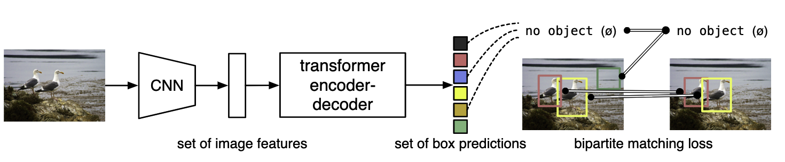
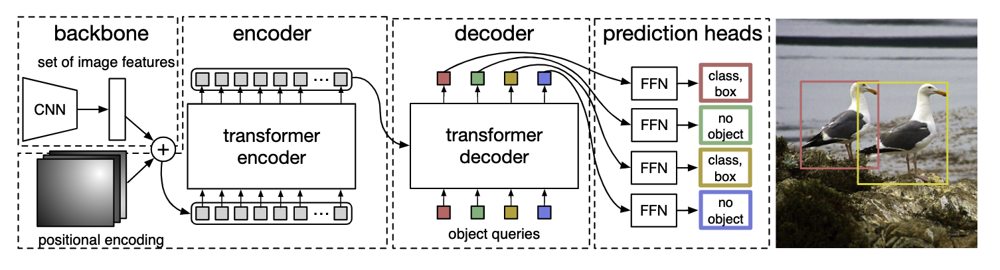

# DETR

## 论文阅读

[End-to-End Object Detection with Transformers](https://arxiv.org/pdf/2005.12872.pdf)
（2020.5）

[官方代码](https://github.com/facebookresearch/detr)

把目标检测看成集合（框）预测的任务，把目标检测做成端到端的框架，减少了生成anchor的木粉，也用不到nms

提出的新的目标函数，通过二分图匹配的方式，强制模型生成独一无二的预测。给定一组查询，DETR 推理对象和全局图像上下文的关系，以并行直接输出最终的预测集。



首先用CNN抽特征，然后用Transformer Encoder学全局特征，用Decoder去生成预测框
（decoder中还有输入object query）得到最后输出的框（100个），用二分图匹配的方式算loss

推理的时候最后一步用一个阈值卡个置信度，大于某个值算前景物体

### 基于集合的目标函数

$y$是ground truth，$\hat{y} = \{ \hat{y}_i \}_i ^N$ 是N个预测值，ground truth中没有出现的标记为$\varnothing$ （back ground），最优匹配 $\hat{\sigma}$ 满足最小化匹配误差$\sum_i^N{\mathcal{L}_{match}(y_i,\hat{y}_{\sigma(i)}})$ （最优匹配问题可以用匈牙利算法解决）

每个$y_i = (c_i,b_i)$，$c_i$表示类别，$b_i \in {[0,1]}^4$表示相对于图像大小的框的中心坐标和宽高，定义$y_i和\hat{y}_{\sigma(i)}$之间的损失为

$$
\mathcal{L}_{match} = - \mathbb{1}_{c_i \neq \varnothing}\hat{p}_{\hat{\sigma}(i)(c_i)} + \mathbb{1}_{c_i \neq \varnothing} \mathcal{L}_{box}(b_i,\hat{b}_{\hat{\sigma}(i)})
$$

bounding box 损失定义为

$$
\mathcal{L}_{box}(b_i,\hat{b}_{\sigma(i)}) = \lambda_{IoU}\mathcal{L}_{IoU}(b_i,\hat{b}_{\sigma(i)}) + \lambda_{L_1}  \lVert b_i - \hat{b}_{\sigma(i)} \rVert_1
$$

### 模型结构



```text
输入图片大小为3x800x1066
--> 过CNN抽特征 2048x25x34(800和1066的1/32) -->256x25x34
--> 加上位置编码
--> Transformer Encoder 850x256
--> 和object query 100x256 (100表示输出100个框)做自注意力操作
--> decoder输出 100x256过FFN(共享参数)得到100个框和类别的预测
```

### 模型代码

文章给的简化版代码

```python
import torch
from torch import nn
from torchvision.models import resnet50

class DETR(nn.Module):
    def __init__(self, num_classes, hidden_dim, nheads, num_encoder_layers, num_decoder_layers):
        super().__init__()
        # We take only convolutional layers from ResNet-50 model
        self.backbone = nn.Sequential(*list(resnet50(pretrained=True).children())[:-2])
        self.conv = nn.Conv2d(2048, hidden_dim, 1)
        self.transformer = nn.Transformer(hidden_dim, nheads, num_encoder_layers, num_decoder_layers)
        self.linear_class = nn.Linear(hidden_dim, num_classes + 1)
        self.linear_bbox = nn.Linear(hidden_dim, 4)
        self.query_pos = nn.Parameter(torch.rand(100, hidden_dim))
        self.row_embed = nn.Parameter(torch.rand(50, hidden_dim // 2))
        self.col_embed = nn.Parameter(torch.rand(50, hidden_dim // 2))

    def forward(self, inputs):
        x = self.backbone(inputs)
        h = self.conv(x)
        H, W = h.shape[-2:]
        pos = torch.cat([
            self.col_embed[:W].unsqueeze(0).repeat(H, 1, 1),
            self.row_embed[:H].unsqueeze(1).repeat(1, W, 1),
        ], dim=-1).flatten(0, 1).unsqueeze(1)
        h = self.transformer(pos + h.flatten(2).permute(2, 0, 1), self.query_pos.unsqueeze(1))
        return self.linear_class(h), self.linear_bbox(h).sigmoid()

detr = DETR(num_classes=91, hidden_dim=256, nheads=8, num_encoder_layers=6, num_decoder_layers=6)
detr.eval()
inputs = torch.randn(1, 3, 800, 1200)
logits, bboxes = detr(inputs)
```
