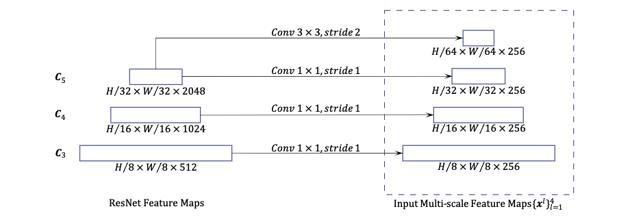

# Deformable DETR

[Deformable DETR: Deformable Transformers For End-to-end Object Detection](https://arxiv.org/pdf/2010.04159.pdf)
（2020.8）

[官方代码](https://github.com/fundamentalvision/Deformable-DETR)

[参考博客](https://zhuanlan.zhihu.com/p/372116181)

DETR的问题：
1.收敛速度慢
2.小目标检测效果差

Deformable DETR结合和变形卷积和DETR解决DETR的问题

每个特征像素不必与所有的特征像素交互计算，只需与部分基于采样的其他像素交互即可，加快了模型的收敛

## DCN

[参考博客](https://blog.csdn.net/justsolow/article/details/105971437)

可形变卷积公式

$$
    \mathbf{y}(\mathbf{p_0}) = \sum_{p_n \in \mathcal{R}} \mathbf{w}(\mathbf{p_n}) \mathbf{x}(\mathbf{p_0} + \mathbf{p_n} + \Delta\mathbf{p_n})
$$

```python
#...
self.offsets = nn.Conv2d(128, 18, kernel_size=3, padding=1)
self.conv4 = DeformConv2D(128, 128, kernel_size=3, padding=1)
#...
offsets = self.offsets(x)
x = F.relu(self.conv4(x, offsets))
#...
```

对每个输入的特征图，比如使用3x3的卷积核，offset就是2x3x3=18（x，y），先过卷积层得到feature map上每个点对应的9个点的offset的xy，然后通过算出每个点对应的九个点的值（对9个点每个点用双线性插值算出值），然后把每个点对应的3x3的搞在一起，比如10x10的特征图变成30x30，然后过一个3x3的kernel，strike为3的卷积层。DCN可训练的参数就是得到offset的卷积核的参数以及最后那个卷积核的参数。这里对于所有进defromConv2D的特征图都用的同一个偏移量。

## Deformable Transformers



### Multi-Head Attention

这里重写了一下多头注意力的计算公式

$$
\text{MultiHeadAttn}(z_q,\mathbf{x}) = \sum_{m=1}^{M} \mathbf{W}_m[\sum_{k \in \Omega_k} A_{mqk}\mathbf{W}_m^\prime x_k]
$$

和 $\text{softmax}(\frac{QK^T}{\sqrt{d}})V$那个的多头版的公式是等价的。[d2l-multihead](../DeepLearning.md###Mutihead-Attention)

其中 $q \in \Omega_q$ 表示query的index，$k \in \Omega_k$ 表示key和value的index（包括所有的HW个点），$z_q,x_k\in \mathbb{R}^C$，M表示头的个数，$\mathbf{W}_m^\prime \in \mathbb{R}^{C_v \times C}$，$\mathbf{W}_m \in \mathbb{R}^{C \times C_v}$ （$C_v =C / M$），attention的权重$A_{mqk} \propto \exp{(\frac{z_q^TU_m^TV_mx_k}{\sqrt{C_v}})}$，并且满足$\sum_{k \in \Omega_k}A_{mqk} = 1$ （softmax），$U_m,V_m \in \mathbb{R}^{C_v \times C}$。

这种计算方式有两个问题：一是收敛很慢，需要大量的训练，因为当 $N_k$ 很大的时候$A_{mqv}$接近于$1/N_k$导致输入特征的梯度模糊；二是注意力计算的复杂度很高，上式的计算复杂度为 $O(N_qC^2 + N_k C^2 + N_qN_kC)$（没搞懂怎么算的文章是这样），在图像领域一般有$N_q = N_k \gg C$，有复杂度为$O(N_qN_kC)$随着特征图大小的二次复杂度增长。

### Deformable Attention

给定一个 feature map $\mathbf{x} \in \mathbb{R}^{C \times H \times W}$,2-d的point $p_q$，这里$K$表示采样的点的个数，有 $HW \gg K$

$$
\text{DeformAttn}(z_q,\mathbf{x}) = \sum_{m=1}^{M} \mathbf{W}_m[\sum_{k=1}^K A_{mqk}\mathbf{W}_m^\prime \mathbf{x}(p_q + \Delta p_{mqk})]
$$

这里 $\Delta p_{mqk} \in \mathbb{R}^2$ 没有约束，由于$\mathbf{x}(p_q + \Delta p_{mqk})$ 并不一定是整数，使用了双线性插值计算。

### Multi-scale Deformable Attention

$$
\text{MSDeformAttn}(z_q,\hat{p}_q,\{\mathbf{x}^l\}^L_{l=1}) = \sum_{m=1}^{M} \mathbf{W}_m[\sum_{l=1}^L\sum_{k=1}^K A_{mlqk}\mathbf{W}_m^\prime \mathbf{x}^l(\phi_l(\hat{p_q}) + \Delta p_{mlqk})]
$$

L表示输入特征的层级，$\phi_l(\hat{p}_q)$ 将归一化坐标 $\hat{p}_q$ 重新缩放到第 $l$ 层级的特征图，$A_{mlqk}$ 满足 $\sum_{l=1}^L\sum_{k=1}^KA_{mlqk} = 1$

当 $L=K=1$，$W_m^\prime$ 为单位矩阵呢时相当于可变形卷积

### Encoder Decoder

用多尺度可形变注意力模块替换DETR中处理特征的Transformer Encoder

Decoder中只把cross-attention的模块替换为多尺度可变形注意力，self-attention保持不变

## Additional Inprovements

Iterative Bounding Box Refinement和Two-Stage Deformable DETR

### Iterative Bounding Box Refinement

**Bounding Box 偏移量修正**
deformable DERR 的bbox预测头的预测结果是相对于参考点的坐标偏移量，这样设计可以降低网络的优化难度

首先经过simoid得到的参考点坐标过一个逆函数，后面加上偏移量修正坐标

$$
\hat{\mathbf{b}}_q = \{\sigma(\mathbf{b}_{qx} + \sigma ^{-1}(\hat{p}_{qx})),\sigma(\mathbf{b}_{qy} + \sigma ^{-1}(\hat{p}_{qy})),\sigma(\mathbf{b}_{qw}),\sigma(\mathbf{b}_{qh}) \}
$$

就是每次过一层decoder，reference point都用输出的参考点的值（不启用的话就是用初始的值加上偏移量）

第d层decoder layer

$$
\hat{\mathbf{b}}_q^d = \{\sigma(\Delta b^{d}_{qx} + \sigma^{-1}(\hat{b}^{d-1}_{qx})),\sigma(\Delta b^{d}_{qy} + \sigma^{-1}(\hat{b}^{d-1}_{qy})),\sigma(\Delta b^{d}_{qw} + \sigma^{-1}(\hat{b}^{d-1}_{qw})),\sigma(\Delta b^{d}_{qh} + \sigma^{-1}(\hat{b}^{d-1}_{qh}))\}
$$

初始化$b^{0}_{qx} = \hat{p}_{qx}$，$b^{0}_{qy} = \hat{p}_{qy}$，$b^{0}_{qw} = 0.1$，$b^{0}_{qh} = 0.1$

并且每一层decoder得到box的FFN不共享参数（clone了6个）。

### Two-Stage Deformable DETR

没有two stage的话decoder的query embedding是可以学习的参数，two stage decoder 的query是encoder的输出得到proposal，直接用decoder最后的class分类头得到top score（300个）的得到proposal生成的。

## Code

[注释版源代码](https://github.com/xunull/read-Deformable-DETR)

找到了一篇源码解析的[博客](https://www.jianshu.com/p/a1f4831a21b2)

### MSDefromAtten

```python
#class MSDeformAttn
    def forward(self, query, reference_points,
                input_flatten, input_spatial_shapes,
                input_level_start_index,
                input_padding_mask=None):
        """
        query是上一层的输出加上了位置编码
        :param query                       (N, Length_{query}, C)
        参考点位的坐标
        :param reference_points            (N, Length_{query}, n_levels, 2), range in [0, 1], top-left (0,0), bottom-right (1, 1), including padding area
                                        or (N, Length_{query}, n_levels, 4), add additional (w, h) to form reference boxes
        encoder是上一层的输出，decoder使用的是encoder的输出 [bs, all hw, 256]
        :param input_flatten               (N, \sum_{l=0}^{L-1} H_l \cdot W_l, C)
        4个特征层的高宽
        :param input_spatial_shapes        (n_levels, 2), [(H_0, W_0), (H_1, W_1), ..., (H_{L-1}, W_{L-1})]
        各个特征层的起始index的下标 如: [    0,  8056, 10070, 10583]
        :param input_level_start_index     (n_levels, ), [0, H_0*W_0, H_0*W_0+H_1*W_1, H_0*W_0+H_1*W_1+H_2*W_2, ..., H_0*W_0+H_1*W_1+...+H_{L-1}*W_{L-1}]
        [bs,all hw]
        :param input_padding_mask          (N, \sum_{l=0}^{L-1} H_l \cdot W_l), True for padding elements, False for non-padding elements

        :return output                     (N, Length_{query}, C)
        """

        # query 是src+pos，query下面变成了attention_weights
        # input_flatten 是src，input_flatten 对应了V
        # bs, all hw（decoder 是300）, 256
        N, Len_q, _ = query.shape
        # [bs,all hw,256]
        N, Len_in, _ = input_flatten.shape

        assert (input_spatial_shapes[:, 0] * input_spatial_shapes[:, 1]).sum() == Len_in
        # 对encoder上一层的输出，或者decoder使用的encoder的输出 进行一层全连接变换，channel不变
        value = self.value_proj(input_flatten)

        if input_padding_mask is not None:
            # 填充0 [bs, all hw,256]
            value = value.masked_fill(input_padding_mask[..., None], float(0))

        # 分成多头，拆分的是最后的256 [bs,all hw,256] -> [bs,all hw, 8, 32]
        value = value.view(N, Len_in, self.n_heads, self.d_model // self.n_heads)
        # sampling_offsets 是一个全连接
        # like (bs, all hw,8,4,4,2) 8个头，4个特征层，4个采样点 2个偏移量坐标
        sampling_offsets = self.sampling_offsets(query).view(N, Len_q, self.n_heads, self.n_levels, self.n_points, 2)
        # attention_weights 是一个全连接
        # like (bs, all hw,8,16)
        attention_weights = self.attention_weights(query).view(N, Len_q, self.n_heads, self.n_levels * self.n_points)

        # like (bs,all hw,8,4,4)
        # 经过softmax 保证权重和为1
        attention_weights = F.softmax(attention_weights, -1).view(N, Len_q, self.n_heads, self.n_levels, self.n_points)

        # N, Len_q, n_heads, n_levels, n_points, 2
        if reference_points.shape[-1] == 2:

            # input_spatial_shapes 换位置，高宽 变成 宽高
            offset_normalizer = torch.stack([input_spatial_shapes[..., 1], input_spatial_shapes[..., 0]], -1)

            # reference_points  [bs,all hw,4,2] -> [bs,all hw,1,4,1,2]
            # sampling_offsets  [bs,all hw,8,4,4,2]
            # offset_normalizer [4,2] -> [1,1,1,4,1,2]
            # like (bs, hw,8,4,4,2)
            # 采样点加上偏移量
            sampling_locations = reference_points[:, :, None, :, None, :] \
                                 + sampling_offsets / offset_normalizer[None, None, None, :, None, :]

        elif reference_points.shape[-1] == 4:

            sampling_locations = reference_points[:, :, None, :, None, :2] \
                                 + sampling_offsets / self.n_points * reference_points[:, :, None, :, None, 2:] * 0.5
        else:
            raise ValueError(
                'Last dim of reference_points must be 2 or 4, but get {} instead.'.format(reference_points.shape[-1]))

        # 这里调用了cuda实现
        output = MSDeformAttnFunction.apply(
            value, input_spatial_shapes, input_level_start_index,
            sampling_locations, attention_weights,
            self.im2col_step)

        output = self.output_proj(output)
        return output
```

这里算到的是attention weight算出来了， $\mathbf{x}^l(\phi_l(\hat{p_q}) + \Delta p_{mlqk})$ 这个是通过`F.grid_sample()`双线性插值算出来的

```python
def ms_deform_attn_core_pytorch(value, value_spatial_shapes, sampling_locations, attention_weights):
    # for debug and test only,
    # need to use cuda version instead
    N_, S_, M_, D_ = value.shape
    _, Lq_, M_, L_, P_, _ = sampling_locations.shape
    value_list = value.split([H_ * W_ for H_, W_ in value_spatial_shapes], dim=1)
    sampling_grids = 2 * sampling_locations - 1
    sampling_value_list = []
    for lid_, (H_, W_) in enumerate(value_spatial_shapes):
        # N_, H_*W_, M_, D_ -> N_, H_*W_, M_*D_ -> N_, M_*D_, H_*W_ -> N_*M_, D_, H_, W_
        value_l_ = value_list[lid_].flatten(2).transpose(1, 2).reshape(N_ * M_, D_, H_, W_)
        # N_, Lq_, M_, P_, 2 -> N_, M_, Lq_, P_, 2 -> N_*M_, Lq_, P_, 2
        sampling_grid_l_ = sampling_grids[:, :, :, lid_].transpose(1, 2).flatten(0, 1)
        # N_*M_, D_, Lq_, P_
        sampling_value_l_ = F.grid_sample(value_l_, sampling_grid_l_,
                                          mode='bilinear', padding_mode='zeros', align_corners=False)
        sampling_value_list.append(sampling_value_l_)
    # (N_, Lq_, M_, L_, P_) -> (N_, M_, Lq_, L_, P_) -> (N_, M_, 1, Lq_, L_*P_)
    attention_weights = attention_weights.transpose(1, 2).reshape(N_ * M_, 1, Lq_, L_ * P_)
    output = (torch.stack(sampling_value_list, dim=-2).flatten(-2) * attention_weights).sum(-1).view(N_, M_ * D_, Lq_)
    return output.transpose(1, 2).contiguous()
```

### Deformable transformer

Encoder主要就是把Mutihead-attention换成MSDeformAtten，输入增加了一些点和层级的信息，输入的src的形状为(batch_size,sum of hw, d_model)

```python
class DeformableTransformerEncoderLayer(nn.Module):
    def __init__(self,
                 d_model=256, d_ffn=1024,
                 dropout=0.1, activation="relu",
                 n_levels=4, n_heads=8,
                 # Deformable的内容
                 n_points=4):
        super().__init__()

        # self attention
        self.self_attn = MSDeformAttn(d_model, n_levels, n_heads, n_points)
        self.dropout1 = nn.Dropout(dropout)
        self.norm1 = nn.LayerNorm(d_model)

        # ffn 的内容
        self.linear1 = nn.Linear(d_model, d_ffn)
        self.activation = _get_activation_fn(activation)
        self.dropout2 = nn.Dropout(dropout)
        self.linear2 = nn.Linear(d_ffn, d_model)
        self.dropout3 = nn.Dropout(dropout)
        self.norm2 = nn.LayerNorm(d_model)

    @staticmethod
    def with_pos_embed(tensor, pos):
        return tensor if pos is None else tensor + pos

    def forward_ffn(self, src):
        # 一个全连接，一个激活，一个dropout，一个全连接
        src2 = self.linear2(self.dropout2(self.activation(self.linear1(src))))
        # add 和 dropout
        src = src + self.dropout3(src2)
        # norm
        src = self.norm2(src)
        return src

    def forward(self, src, pos, reference_points, spatial_shapes, level_start_index, padding_mask=None):
        """
        src: [bs,all hw,256]
        pos: [bs,all hw,256]
        reference_points: [bs,all hw,4,2]
        spatial_shapes: [4,2] 4个特征层的高宽
        level_start_index: 各个特征层的起始index的下标 如: [    0,  8056, 10070, 10583]
        padding_mask: [bs,all hw]
        """
        # with_pos_embed 就是将src和pos相加, src是上一层encoder的输出
        # 1. self attention
        src2 = self.self_attn(self.with_pos_embed(src, pos), reference_points, src,
                              spatial_shapes, level_start_index, padding_mask)
        # 2. add
        src = src + self.dropout1(src2)
        # 3. norm
        src = self.norm1(src)

        # 4. ffn + add & norm
        src = self.forward_ffn(src)

        return src
```

获取参考点

valid ratio在transformer块中定义

```python
#class DeformableTransformer
    def get_valid_ratio(self, mask):
        """
        图像的大小在一个batch内统一成了最大的高宽，但是具体的一个张图会占据其中左上的某个区域，其他的区域在Mask中是True
        这里就要求出真实的图像大小占据的比率
        mask [bs,h,w]
        有效高宽占总的高宽的比率
        """
        # 特征图的高 宽
        _, H, W = mask.shape

        # tensor的size就是bs的大小 [:,:,0] 就是取的第一列，那么就是高度的意思，~mask，有mask的位置是True，~mask取反
        # 有效的高度
        valid_H = torch.sum(~mask[:, :, 0], 1)
        # 有效的宽度
        valid_W = torch.sum(~mask[:, 0, :], 1)
        # 占总长度的比例
        valid_ratio_h = valid_H.float() / H
        # 占总宽度的比例
        valid_ratio_w = valid_W.float() / W

        valid_ratio = torch.stack([valid_ratio_w, valid_ratio_h], -1)
        #(bs,2)
        return valid_ratio
```

```python
class DeformableTransformerEncoder(nn.Module):
    def __init__(self, encoder_layer, num_layers):
        super().__init__()
        self.layers = _get_clones(encoder_layer, num_layers)
        self.num_layers = num_layers

    @staticmethod
    def get_reference_points(spatial_shapes, valid_ratios, device):
        # spatial_shapes [特征层数,2] valid_ratios [bs,特征层数,2]
        reference_points_list = []

        for lvl, (H_, W_) in enumerate(spatial_shapes):
            # 生成网格点,从0.5开始 到 减掉一个0.5
            ref_y, ref_x = torch.meshgrid(torch.linspace(0.5, H_ - 0.5, H_, dtype=torch.float32, device=device),
                                          torch.linspace(0.5, W_ - 0.5, W_, dtype=torch.float32, device=device))

            # 坐标进行缩放 valid_ratios[:, None, lvl, 1] * H_是在H_基础上进一步缩减范围

            # reshape(-1) 拉平会变成一维的 shape=hw，[None]，会在最前面加上一个1维度(1,hw)
            # valid_ratios(bs,num_lvl,2) 切片操作 -> (bs,1)
            ref_y = ref_y.reshape(-1)[None] / (valid_ratios[:, None, lvl, 1] * H_)
            ref_x = ref_x.reshape(-1)[None] / (valid_ratios[:, None, lvl, 0] * W_)
            # ref 的形状(bs,hw,2)
            ref = torch.stack((ref_x, ref_y), -1)

            reference_points_list.append(ref)
        # 所有特征层的参考点拼在一起 [bs,all hw,2]
        reference_points = torch.cat(reference_points_list, 1)

        # reference_points[:,:,None] -> [bs,all hw,1,2]
        # valid_ratios[:,None] -> [bs,1,特征层数量,2]
        reference_points = reference_points[:, :, None] * valid_ratios[:, None]
        # [bs,all hw,特征层数,2]
        return reference_points

    def forward(self, src, spatial_shapes, level_start_index, valid_ratios, pos=None, padding_mask=None):
        """
        src: [bs,all hw,256] backbone的特征
        spatial_shapes: [特征层的数量,2] 各个特征层的高宽
        level_start_index: 各个层的 all hw中的起始坐标位置
        valid_ratios: [bs,4,2] todo 
        pos: [bs,all hw,256] 位置编码
        padding_mask: [bs, all hw]
        """
        output = src
        # 获取参考点
        # encoder的参考点是grid生成的，并且不会精炼，不会有迭代的更新
        # [bs,all hw,4,2]
        reference_points = self.get_reference_points(spatial_shapes, valid_ratios, device=src.device)
        for _, layer in enumerate(self.layers):
            # [bs,all hw,256]
            output = layer(output, pos, reference_points,
                           spatial_shapes, level_start_index, padding_mask)

        return output
```

```python
class DeformableTransformerDecoderLayer(nn.Module):
    def __init__(self, d_model=256, d_ffn=1024,
                 dropout=0.1, activation="relu",
                 n_levels=4, n_heads=8, n_points=4):
        super().__init__()
        # Deformable DETR实现的Attention
        # cross attention
        self.cross_attn = MSDeformAttn(d_model, n_levels, n_heads, n_points)
        self.dropout1 = nn.Dropout(dropout)
        self.norm1 = nn.LayerNorm(d_model)
        # 标准的Attention
        # self attention
        self.self_attn = nn.MultiheadAttention(d_model, n_heads, dropout=dropout)
        self.dropout2 = nn.Dropout(dropout)
        self.norm2 = nn.LayerNorm(d_model)

        # ffn
        self.linear1 = nn.Linear(d_model, d_ffn)
        self.activation = _get_activation_fn(activation)
        self.dropout3 = nn.Dropout(dropout)
        self.linear2 = nn.Linear(d_ffn, d_model)
        self.dropout4 = nn.Dropout(dropout)
        self.norm3 = nn.LayerNorm(d_model)

    @staticmethod
    def with_pos_embed(tensor, pos):
        return tensor if pos is None else tensor + pos

    def forward_ffn(self, tgt):
        tgt2 = self.linear2(self.dropout3(self.activation(self.linear1(tgt))))
        tgt = tgt + self.dropout4(tgt2)
        tgt = self.norm3(tgt)
        return tgt

    def forward(self, tgt, query_pos, reference_points,
                src, src_spatial_shapes, level_start_index,
                src_padding_mask=None):
        """
        tgt 是上一层的输出 [bs,300,256]
        query_pos 就是外面的query_embed [bs,300,256]
        reference_points 各个image在300个query上每个特征层上的参考点的坐标 [bs,300,4,2]
        src是encoder的输出 [bs,all hw,256]
        src_spatial_shapes 各个特征层的高宽 [4,2]
        level_start_index 各个特征层的起始下标
        src_padding_mask mask
        """

        # self attention
        # tgt和query_pos相加, q k就是这两个构成了
        q = k = self.with_pos_embed(tgt, query_pos)
        # 1. self-attention, q k在上面创建了，value就还是tgt
        tgt2 = self.self_attn(q.transpose(0, 1), k.transpose(0, 1), tgt.transpose(0, 1))[0].transpose(0, 1)
        # 2. add
        tgt = tgt + self.dropout2(tgt2)
        # 3. norm
        tgt = self.norm2(tgt)

        # Deformable DETR实现的attention
        # 4. cross attention

        # reference_points 各个image在300个query上每个特征层上的目标点位 [bs,300,4,2]
        # src是encoder的输出 [bs,all hw,256]
        # src_spatial_shapes 各个特征层的高宽 [4,2]
        # level_start_index 各个特征层的起始下标
        # src_padding_mask mask
        tgt2 = self.cross_attn(self.with_pos_embed(tgt, query_pos),
                               reference_points,
                               src,
                               src_spatial_shapes, level_start_index, src_padding_mask)

        # 5. add
        tgt = tgt + self.dropout1(tgt2)
        # 6. norm
        tgt = self.norm1(tgt)

        # 7. ffn add & norm
        tgt = self.forward_ffn(tgt)

        return tgt

```

```python
class DeformableTransformerDecoder(nn.Module):
    def __init__(self, decoder_layer, num_layers, return_intermediate=False):
        super().__init__()
        self.layers = _get_clones(decoder_layer, num_layers)
        self.num_layers = num_layers
        self.return_intermediate = return_intermediate

        # hack implementation for iterative bounding box refinement and two-stage Deformable DETR
        self.bbox_embed = None
        self.class_embed = None

    def forward(self, tgt, reference_points, src,
                src_spatial_shapes, src_level_start_index, src_valid_ratios,
                query_pos=None, src_padding_mask=None):
        """
        tgt 从query_embed分出来的 [bs,300,256]
        reference_points reference_point query_embed经过全连接网络生成的 [bs,300,2], 参考点的初始参考点
        src encoder的输出 [bs, all hw,256]
        src_spatial_shapes 各个特征层的高宽 [4,2]
        src_level_start_index 各个特征层的起始下标
        src_valid_ratios [bs,4,2] 各个图像真实的高宽占据Mask大小中的比率
        query_pos 就是外面的query_embed [bs,300,256]
        src_padding_mask [bs,all hw]
        """

        output = tgt

        intermediate = []

        intermediate_reference_points = []

        for lid, layer in enumerate(self.layers):
            # 参考点的坐标
            assert reference_points.shape[-1] == 2
            # [bs,300,2] -> [bs,300,1,2] [bs,4,2] -> [bs,1,4,2]
            # reference_points_input [bs,300,4,2]
            # 参考点坐标也要按比例的进行缩放
            reference_points_input = reference_points[:, :, None] * src_valid_ratios[:, None]

            # 如果没有使用bbox精炼，那么每次的reference_points_input 其实是相同的
            # 如果使用了bbox精炼，那么每次的reference_points_input 是不同的，会使用decoder的输出得到偏移量修正

            # output 是上一层的输出
            # query_pos 就是外面的query_embed
            # reference_points_input 各个image在300个query上每个特征层上的目标点位
            # src是encoder的输出
            # src_spatial_shapes 各个特征层的高宽
            # src_level_start_index 各个特征层的起始下标
            # src_padding_mask mask
            output = layer(output, query_pos, reference_points_input,
                           src, src_spatial_shapes, src_level_start_index,
                           src_padding_mask)

            # 如果使用了with_box_refine模式, 这个地方的bbox_embed 是非None的
            # hack implementation for iterative bounding box refinement
            if self.bbox_embed is not None:
                # output 是上一层decoder的输出，经过bbox预测网络 [bs,300,4]
                # 得到此次的bbox的偏移量修正
                tmp = self.bbox_embed[lid](output)

                if reference_points.shape[-1] == 4:
                    # inverse_sigmoid sigmoid的反函数
                    new_reference_points = tmp + inverse_sigmoid(reference_points)

                    new_reference_points = new_reference_points.sigmoid()
                else:
                    assert reference_points.shape[-1] == 2  # [bs,300,2]
                    # [bs,300,4]
                    new_reference_points = tmp
                    # 前两个是bbox的中心坐标，中心坐标用reference_points的内容+偏移量修正
                    new_reference_points[..., :2] = tmp[..., :2] + inverse_sigmoid(reference_points)
                    # [bs,300,4] 经过sigmoid 约束在0-1
                    new_reference_points = new_reference_points.sigmoid()
                # 替换了原来的reference_points
                reference_points = new_reference_points.detach()

            # 返回前几层，否则只返回最后一层
            if self.return_intermediate:
                intermediate.append(output)
                # 如果是精炼模式，reference_points在各个层之后是不同的
                # 如果不是精炼模型，reference_points在各个层之后还是同一份内容
                intermediate_reference_points.append(reference_points)

        if self.return_intermediate:
            return torch.stack(intermediate), torch.stack(intermediate_reference_points)

        return output, reference_points
```

当不是two_stage的情况

```python
class DeformableTransformer(nn.Module):
    def __init__(self, d_model=256, nhead=8,
                 num_encoder_layers=6, num_decoder_layers=6, dim_feedforward=1024, dropout=0.1,
                 activation="relu", return_intermediate_dec=False,
                 num_feature_levels=4,
                 # 这两个4应该就是这个论文主要的Deformable的内容
                 dec_n_points=4,
                 enc_n_points=4,

                 two_stage=False, two_stage_num_proposals=300):
        super().__init__()

        self.d_model = d_model
        self.nhead = nhead
        self.two_stage = two_stage
        self.two_stage_num_proposals = two_stage_num_proposals

        encoder_layer = DeformableTransformerEncoderLayer(d_model, dim_feedforward,
                                                          dropout, activation,
                                                          num_feature_levels, nhead, enc_n_points)
        self.encoder = DeformableTransformerEncoder(encoder_layer, num_encoder_layers)

        decoder_layer = DeformableTransformerDecoderLayer(d_model, dim_feedforward,
                                                          dropout, activation,
                                                          num_feature_levels, nhead, dec_n_points)
        self.decoder = DeformableTransformerDecoder(decoder_layer, num_decoder_layers, return_intermediate_dec)

        # deformable detr 多的内容 论文中有提及
        self.level_embed = nn.Parameter(torch.Tensor(num_feature_levels, d_model))

        self.reference_points = nn.Linear(d_model, 2)
        # 参数重制
        self._reset_parameters()

    def forward(self, srcs, masks, pos_embeds, query_embed=None):
        """
        srcs backbone的特征
        masks seg使用的
        pos_embeds 位置编码
        query_embed decoder使用
        """
        # 有two_stage 或者不是two_stage但是要有query_embed
        assert self.two_stage or query_embed is not None

        # prepare input for encoder
        src_flatten = []

        mask_flatten = []

        lvl_pos_embed_flatten = []
        # 特征图的高宽
        spatial_shapes = []
        # src内的特征图是从大尺寸到小尺寸
        for lvl, (src, mask, pos_embed) in enumerate(zip(srcs, masks, pos_embeds)):
            bs, c, h, w = src.shape
            # 特征图的高宽
            spatial_shape = (h, w)

            spatial_shapes.append(spatial_shape)
            # [bs,hw,256]
            src = src.flatten(2).transpose(1, 2)  # 这块维度的顺序与detr不同 detr 是 hw，bs，dim，这里是 bs,hw, dim
            # [bs,hw]
            mask = mask.flatten(1)
            # [bs,hw,256]
            pos_embed = pos_embed.flatten(2).transpose(1, 2)
            # level embed 会被加入到位置编码中,level是在论文中提到过的
            # 这个还多个level pos embed [bs,hw,256]
            lvl_pos_embed = pos_embed + self.level_embed[lvl].view(1, 1, -1)

            lvl_pos_embed_flatten.append(lvl_pos_embed)
            src_flatten.append(src)
            mask_flatten.append(mask)

        # [bs,all hw,256]
        # 所有特征层的拼在一起
        # 他们就是在维度1上长度不同，尺寸越大的特征层，1上的数量越多
        src_flatten = torch.cat(src_flatten, 1)

        # [bs,all hw]
        mask_flatten = torch.cat(mask_flatten, 1)

        # [bs, all hw,256]
        lvl_pos_embed_flatten = torch.cat(lvl_pos_embed_flatten, 1)

        # [特征层的数量，2] 存储的是高宽
        spatial_shapes = torch.as_tensor(spatial_shapes, dtype=torch.long, device=src_flatten.device)

        # 各个src层 起始的位置, 第一个spatial_shapes.new_zeros((1,))是在起始位置填的0
        level_start_index = torch.cat((spatial_shapes.new_zeros((1,)), spatial_shapes.prod(1).cumsum(0)[:-1]))

        # 有效高宽占总的batch高宽的比率 [bs,4,2]
        valid_ratios = torch.stack([self.get_valid_ratio(m) for m in masks], 1)

        # src_flatten 类似detr中的src，mask_flatten应该是对应了src_key_padding_mask，lvl_pos_embed_flatten对应了pos
        # 其他的三个完全是这里多出来的参数
        # encoder
        # [bs,all hw,256]
        memory = self.encoder(src_flatten, spatial_shapes, level_start_index,
                              valid_ratios, lvl_pos_embed_flatten, mask_flatten)

        # prepare input for decoder
        bs, _, c = memory.shape

        
        # query_embed [300,512] -> [300,256] tgt [300,256]
        query_embed, tgt = torch.split(query_embed, c, dim=1)

        # 扩出第0维度，bs
        query_embed = query_embed.unsqueeze(0).expand(bs, -1, -1)
        # 扩充第0维度成为bs
        tgt = tgt.unsqueeze(0).expand(bs, -1, -1)

        # [bs,300,2]  reference_points为全连接层 512-2，生成出参考点位坐标
        # 这些坐标经过了sigmoid处理，在最后得到修正的点的坐标时，还会使用sigmoid的反函数
        reference_points = self.reference_points(query_embed).sigmoid()
        # 经过网络初始生成出的参考点坐标
        init_reference_out = reference_points

        # decoder
        # tgt 从query_embed分出来的 [bs,300,256]
        # reference_points  query_embed经过全连接网络生成的 [bs,300,2] 为初始的参考点坐标
        # memory encoder的输出 [bs, all hw,256]
        # spatial_shapes 各个特征层的高宽 [4,2]
        # level_start_index 各个特征层的起始下标
        # valid_ratios [bs,4,2]
        # query_embed [bs,300,256]
        # mask_flatten [bs,all hw]
        # hs [6,bs,300,256]
        # inter_references [6,bs,300,2]
        hs, inter_references = self.decoder(tgt, reference_points, memory,
                                            spatial_shapes, level_start_index, valid_ratios,
                                            query_embed, mask_flatten)

        inter_references_out = inter_references

        return hs, init_reference_out, inter_references_out, None, None
```
