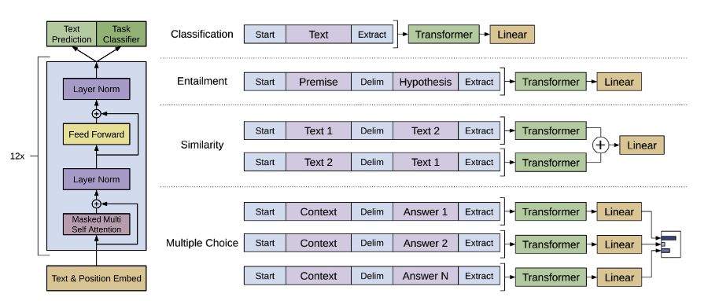

# GPT

## 论文阅读

### GPT1

[Improving Language Understanding by Generative Pre-Training](https://cdn.openai.com/research-covers/language-unsupervised/language_understanding_paper.pdf)

现在没有标签的数据上训练一个预训练语言模型，在下游任务的数据上进行有监督微调

#### Unsupervised pre-training

给定词元语料库 $\mathcal{U} = \{u_1,u_2,...,u_n\}$ ，最大化以下似然函数

$$
    L_1(\mathcal{U}) = \sum_i \log(P(u_i \mid u_{i-k},...,u_{i-1};\mathcal{\Theta}))
$$

其中$k$是上下文窗口大小，$\Theta$表示模型参数

使用的模型是Transformer的Decoder

$$
    h_0 = UW_e + W_p
$$

$$
    h_l = \text{transformerblock}(h_{l-1})  \forall i \in [1,n]
$$

$$
    P(u) = \text{softmax}(h_n W_e^T)
$$

其中$U = (u_{i-k},...,u_{i-1})$表示上下文词向量，$n$表示decoder层数，$W_e$是token embedding矩阵，$W_p$是position embedding矩阵。

> Transformer encoder 和 decoder 最主要的区别就是decoder使用mask，encoder可以看到整个序列而decoder只能够看到前面的

#### Supervised fine-tuning

给定一个有标签的数据集$\mathcal{C}$，每个实例是输入tokens组成的句子$x^1,x^2,...,x^m$和一个label $y$，把输入序列放进transformer块中得到最后一层中$x_m$这个词对应的输出$h_l^m$在过全链接层和softmax

$$
    P(y \mid x^1,...,x^m) = \text{softmax}(h_l^m W_y)
$$

目标函数是最大化

$$
    L_2(\mathcal{C}) = \sum_{(x,y)}\log(y \mid x^1,...,x^m)
$$

使用以下目标函数能够提高性能

$$
    L_3(\mathcal{C}) = L_2(\mathcal{C}) + \lambda L_1(\mathcal{{C}})
$$

#### Task-specific input transformations

第一类是对文字进行分类，把想要分类的文本的前面和末尾加一个特殊字符，放进transformer，最后一个字符(extract)的输出放进线性层进行训练，多分类问题，分类个数由任务确定

第二类是蕴含，给两句话A，B是否有蕴含关系，例如A是1送2玫瑰，B是1喜欢2（A蕴含B），B是1讨厌2（A不蕴含B），B是1和2是邻居（AB没关系），就是一个三分类的问题

第三类是相似，判断text1和text2是否相似，由于语言模型中有先后顺序，所以这里用两个，交换顺序，分别进入模型后的输出相加过线性层，二分类问题

第四类是多选题，对每个答案，都把问题+答案放进去，输出经过线性层得到的标量做softmax，计算得到每个问题的是正确答案的置信度

### GPT2

[Language Models are Unsupervised Multitask Learners](https://cdn.openai.com/better-language-models/language_models_are_unsupervised_multitask_learners.pdf)

在更大的数据集上训练了更大的模型，但效果并没有比BERT好很多，zero-shot是主要的优势（在下游任务上不需要有标注的数据也不用微调，直接就能够用）

GPT2的模型和GPT1相同，在GPT1的下游任务微调中加入了一些特殊的符号，但是GPT2希望做zero-shot，因此模型并不知道这些符号所代表的含义，因此在构造输入的时候，要使得输入构造的和之前预训练的时候的文本长的类似，也就是输入的形式更像自然语言。例如翻译任务给输入(translate to french,English text, French text)（就是后面说的prompt）。

### GPT3

[Language Models are Few-Shot Learners](https://arxiv.org/pdf/2005.14165.pdf)

尝试提高GPT2的有效性，不追求极致的zero-shot，而是采用few-shot，使得下游任务的训练成本较小

模型大小为175B，在这么大数量的参数下做微调的成本很高，因此在做子任务也不做任何的梯度更新，而是输入提供样例。

