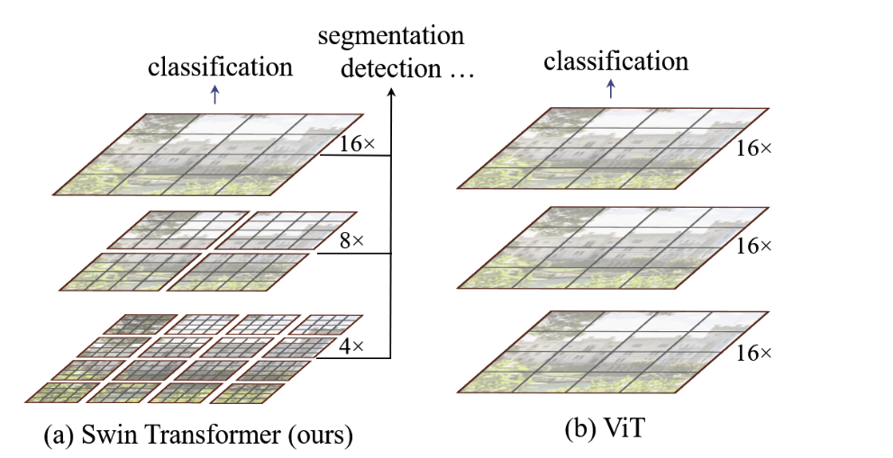
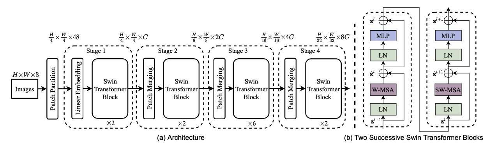
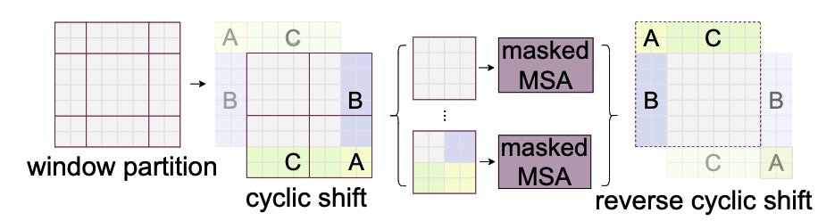
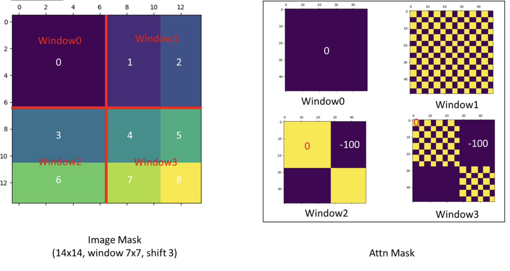

# Swin Transformer

[Swin Transformer: Hierarchical Vision Transformer using Shifted Windows](https://arxiv.org/abs/2103.14030)
（2021.5）

[官方代码](https://github.com/microsoft/Swin-Transformer)

## 论文阅读

ViT只做了分类任务，Swin Transformer说明了transformer可以做为CV领域的骨干网络



Transformer每个patch的尺寸都是相同的，虽然能够通过全局的自注意力达到全局的建模能力，但是对于多尺寸的信息把握较弱

> CNN多尺寸的信息
>
> 目标检测FPN 利用每个卷积层出来的特征
>
> 物体分割UNet Skip Connection 上采样的过程中还利用之前下采样过程中拿出来的特征

ViT由于使用全局建模，模型的复杂度和输入图像尺寸的平方倍进行增长；Swin Transformer在小窗口上进行注意力的计算

类似于CNN的Pooling操作，Swin Transformer使用了Patch Merging的操作，增大感受野，并能够抓住图像的多尺寸信息

### 整体架构



```text
输入图片为224x224x3
--> Patch Partition 56x56x48
--> Liner Embedding 3136 x 96(这的的Swin-T C为96)
--> Swin Transformer Block 不改变维度（3136显然太大，这里基于窗口计算自注意力）
--> Patch Merging （先得到H/2 W/2 4*C 过1x1的卷积得到2*C ）28x28x192
--> stage3 14x14x384
--> stage4 7x7x768
（分类任务 -->1x768->全连接）
```

patch merging怎么采样的：

```python
x0 = x[:, 0::2, 0::2, :]  # B H/2 W/2 C
x1 = x[:, 1::2, 0::2, :]  # B H/2 W/2 C
x2 = x[:, 0::2, 1::2, :]  # B H/2 W/2 C
x3 = x[:, 1::2, 1::2, :]  # B H/2 W/2 C
x = torch.cat([x0, x1, x2, x3], -1)  # B H/2 W/2 4*C
```

### 基于移动窗口的自注意力

#### 窗口自注意力计算

```text
56x56x96的输入，分成小窗口，每个窗口有MxM个patch（M默认为7），有8x8=64个窗口
```

**计算自注意力的复杂度**假设图像的高宽为 $h \times w$，注意力的输入就是 $hw \times C$，如果使用全局自注意力的计算，分为：

1. 计算qkv。是$hw \times C$ 乘一个 $C \times C$的矩阵，复杂度为 $hwC^2 \times 3$
2. 计算权重矩阵A，然后乘v。是 q乘v的转置，就是$hw \times C$乘上 $C \times hw$，得到权重矩阵和和v乘，就是 $hw \times hw$乘上$hw \times C$ ，复杂度为 $(hw)^2C + (hw)^2C$
3. 投影得到输出。就是$hw \times C$ 乘一个 $C \times C$的矩阵。

因此复杂度为$\Omega(MSA) = 4hwC^2 + 2(hw)^2C$

如果采用窗口计算，上面公式的$h=w=M$，复杂度就是$4MC^2 + 2M^4C$总共有$\frac{h}{M} \times \frac{w}{M}$个窗口，因此复杂度为$\Omega(W-MSA) = 4hwC^2 + 2M^2 hwC$

#### 连续块的移动窗口分区

虽然窗口自注意力能够很好的降低计算复杂度，但是窗口和窗口之间就没有通信了，这样就达不到全局建模了，移动窗口就是为了窗口之间的通信。模型的两个连续的tansformer块中一个做一次窗口自注意力，一个做一次移动窗口的自注意力。

但是直接做移动窗口的话在边上会出现窗口大小不一致的问题，因此提出了循环移位的自注意计算方法



由于边上的窗口的东西是从别的地方移过来的，因此不应该对整个窗口做自注意力，因此使用掩码的操作算注意力，完了在把循环位移还原。

掩码操作：


（window1这样是因为Flatten横着来的，顺序差不多是111..22...111....）
