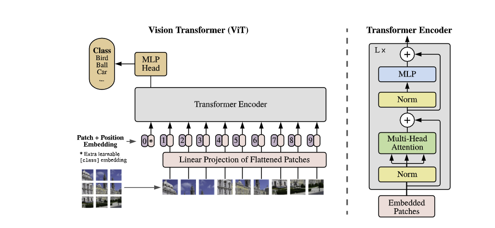

# Vision Transformer

[An Image Is Worth 16X16 Words: Transformers For Image Recognition At Scale](https://arxiv.org/abs/2010.11929)
（2020.10）

[官方代码](https://github.com/google-research/vision_transformer/tree/main)

[参考代码](https://github.com/lucidrains/vit-pytorch/blob/main/vit_pytorch/vit.py)



主要就是图片转换tokens，position embedding这里是可学习的参数

```text
输入224x224x3 
-> Embedding(16x16的卷积核，步距为16的卷积层) 14x14x768 
-> Flatten 196x768 
-> Concat一个Class token 197x768 
-> 加上position embedding -> Dropout 
-> 重复L次 Transformer Encoder 197x768
-> LayerNorm 
-> Extract class token 1x768(之前concat的class token)
-> MLP Head
```

```python
import torch
from torch import nn

from einops import rearrange, repeat
from einops.layers.torch import Rearrange

# helpers

def pair(t):
    return t if isinstance(t, tuple) else (t, t)

# classes

class FeedForward(nn.Module):
    def __init__(self, dim, hidden_dim, dropout = 0.):
        super().__init__()
        self.net = nn.Sequential(
            nn.LayerNorm(dim),
            nn.Linear(dim, hidden_dim),
            nn.GELU(),
            nn.Dropout(dropout),
            nn.Linear(hidden_dim, dim),
            nn.Dropout(dropout)
        )

    def forward(self, x):
        return self.net(x)

class Attention(nn.Module):
    def __init__(self, dim, heads = 8, dim_head = 64, dropout = 0.):
        super().__init__()
        inner_dim = dim_head *  heads
        project_out = not (heads == 1 and dim_head == dim)

        self.heads = heads
        self.scale = dim_head ** -0.5

        self.norm = nn.LayerNorm(dim)

        self.attend = nn.Softmax(dim = -1)
        self.dropout = nn.Dropout(dropout)

        self.to_qkv = nn.Linear(dim, inner_dim * 3, bias = False)

        self.to_out = nn.Sequential(
            nn.Linear(inner_dim, dim),
            nn.Dropout(dropout)
        ) if project_out else nn.Identity()

    def forward(self, x):
        x = self.norm(x)

        qkv = self.to_qkv(x).chunk(3, dim = -1)
        q, k, v = map(lambda t: rearrange(t, 'b n (h d) -> b h n d', h = self.heads), qkv)

        dots = torch.matmul(q, k.transpose(-1, -2)) * self.scale

        attn = self.attend(dots)
        attn = self.dropout(attn)

        out = torch.matmul(attn, v)
        out = rearrange(out, 'b h n d -> b n (h d)')
        return self.to_out(out)

class Transformer(nn.Module):
    def __init__(self, dim, depth, heads, dim_head, mlp_dim, dropout = 0.):
        super().__init__()
        self.norm = nn.LayerNorm(dim)
        self.layers = nn.ModuleList([])
        for _ in range(depth):
            self.layers.append(nn.ModuleList([
                Attention(dim, heads = heads, dim_head = dim_head, dropout = dropout),
                FeedForward(dim, mlp_dim, dropout = dropout)
            ]))

    def forward(self, x):
        for attn, ff in self.layers:
            x = attn(x) + x
            x = ff(x) + x

        return self.norm(x)

class ViT(nn.Module):
    def __init__(self, *, image_size, patch_size, num_classes, dim, depth, heads, mlp_dim, pool = 'cls', channels = 3, dim_head = 64, dropout = 0., emb_dropout = 0.):
        super().__init__()
        image_height, image_width = pair(image_size)
        patch_height, patch_width = pair(patch_size)

        assert image_height % patch_height == 0 and image_width % patch_width == 0, 'Image dimensions must be divisible by the patch size.'

        num_patches = (image_height // patch_height) * (image_width // patch_width)
        patch_dim = channels * patch_height * patch_width
        assert pool in {'cls', 'mean'}, 'pool type must be either cls (cls token) or mean (mean pooling)'

        self.to_patch_embedding = nn.Sequential(
            Rearrange('b c (h p1) (w p2) -> b (h w) (p1 p2 c)', p1 = patch_height, p2 = patch_width),
            nn.LayerNorm(patch_dim),
            nn.Linear(patch_dim, dim),
            nn.LayerNorm(dim),
        )

        self.pos_embedding = nn.Parameter(torch.randn(1, num_patches + 1, dim))
        self.cls_token = nn.Parameter(torch.randn(1, 1, dim))
        self.dropout = nn.Dropout(emb_dropout)

        self.transformer = Transformer(dim, depth, heads, dim_head, mlp_dim, dropout)

        self.pool = pool
        self.to_latent = nn.Identity()

        self.mlp_head = nn.Linear(dim, num_classes)

    def forward(self, img):
        x = self.to_patch_embedding(img)
        b, n, _ = x.shape

        cls_tokens = repeat(self.cls_token, '1 1 d -> b 1 d', b = b)
        x = torch.cat((cls_tokens, x), dim=1)
        x += self.pos_embedding[:, :(n + 1)]
        x = self.dropout(x)

        x = self.transformer(x)

        #cls extract
        x = x.mean(dim = 1) if self.pool == 'mean' else x[:, 0]

        x = self.to_latent(x)
        return self.mlp_head(x)
```

```python
from torchsummary import summary

model_vit = ViT(
        image_size = 224,
        patch_size = 16,
        num_classes = 1000,
        dim = 768,
        depth = 6,
        heads = 16,
        mlp_dim = 2048,
        dropout = 0.1,
        emb_dropout = 0.1
    )

img = torch.randn(16, 3, 224, 224)
summary(model_vit, input_size=img.shape[1:],batch_size=img.shape[0])
print(model_vit(img).shape)
```

```text
----------------------------------------------------------------
        Layer (type)               Output Shape         Param #
================================================================
         Rearrange-1             [16, 196, 768]               0
         LayerNorm-2             [16, 196, 768]           1,536
            Linear-3             [16, 196, 768]         590,592
         LayerNorm-4             [16, 196, 768]           1,536
           Dropout-5             [16, 197, 768]               0
         LayerNorm-6             [16, 197, 768]           1,536
            Linear-7            [16, 197, 3072]       2,359,296
           Softmax-8         [16, 16, 197, 197]               0
           Dropout-9         [16, 16, 197, 197]               0
           Linear-10             [16, 197, 768]         787,200
          Dropout-11             [16, 197, 768]               0
        Attention-12             [16, 197, 768]               0
        LayerNorm-13             [16, 197, 768]           1,536
           Linear-14            [16, 197, 2048]       1,574,912
             GELU-15            [16, 197, 2048]               0
          Dropout-16            [16, 197, 2048]               0
           Linear-17             [16, 197, 768]       1,573,632
          Dropout-18             [16, 197, 768]               0
      FeedForward-19             [16, 197, 768]               0
        LayerNorm-20             [16, 197, 768]           1,536
           Linear-21            [16, 197, 3072]       2,359,296
          Softmax-22         [16, 16, 197, 197]               0

torch.Size([16, 1000])
```
