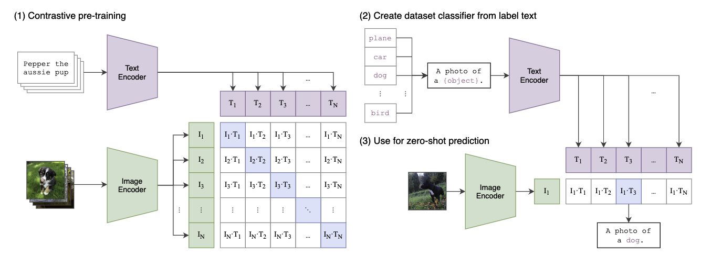

# CLIP

Contrastive Language-Image Pre-training

[Learning Transferable Visual Models From Natural Language Supervision](https://arxiv.org/pdf/2103.00020.pdf)

[OpenAI Blog](https://openai.com/research/clip)



## 预训练方法

文本和图像分别使用预训练好的编码器对每个输入的文本和图像进行编码（ResNet50、ViT...），编码完成的文本特征和视觉特征计算余弦相似度，CLIP的训练目标即使最大化证$N$个正样本的相似度，最小化$N^2 -N$个样本的相似度。

```python
# image_encoder - ResNet or Vision Transformer 
# text_encoder - CBOW or Text Transformer 
# I[n, h, w, c] - minibatch of aligned images 
# T[n, l] - minibatch of aligned texts 
# W_i[d_i, d_e] - learned proj of image to embed 
# W_t[d_t, d_e] - learned proj of text to embed 
# t - learned temperature parameter 

# extract feature representations of each modality 
I_f = image_encoder(I) #[n, d_i] 
T_f = text_encoder(T) #[n, d_t] 

# joint multimodal embedding [n, d_e] 
I_e = l2_normalize(np.dot(I_f, W_i), axis=1) 
T_e = l2_normalize(np.dot(T_f, W_t), axis=1) # scaled pairwise cosine similarities [n, n] 

logits = np.dot(I_e, T_e.T) * np.exp(t) 

# symmetric loss function 
labels = np.arange(n) 
loss_i = cross_entropy_loss(logits, labels, axis=0) 
loss_t = cross_entropy_loss(logits, labels, axis=1) 
loss = (loss_i + loss_t)/2
```

## Zero-shot推理

Prompt Tempelate 比如在分类任务上，把标签搞成 A photo of [object]的样子，输入文本编码器，把图像输入图像编码器，然后计算余弦相似度最大的就是图像的Label。

模型不需要像以往的分类模型一样设置一个固定的类别集合，只要能够在文本输入的地方加入图像真实的类别名称，这里不一定是ImageNet上的类和图像也很有可能被正确分类。不使用ImageNet数据集上任何一张图像进行训练的推理效果和有监督训练好的ResNet50相当。

