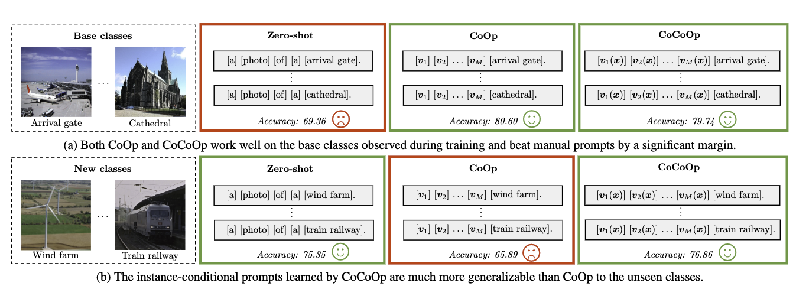
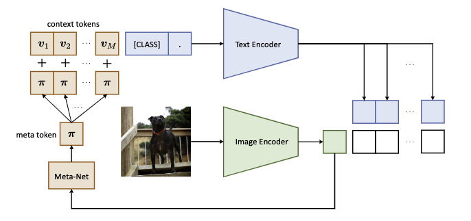

# CoCoOp

Conditional Context Optimization

[Conditional Prompt Learning for Vision-Language Models](https://arxiv.org/pdf/2203.05557.pdf)

CoOp的泛化性并不好，很难泛化到同一个数据集上的unsee class，说明在训练过程中过拟合到了base classes。

## 主要方法

令$x$表示图像经过image encoder的结果，$h_{\theta}$ 表示参数为 $\theta$ 的Meta-Net。每个上下文token $v_m(x) = v_m + \pi$ ，$\pi = h_{\theta}(x)$ ，$m \in \{1,2,...,M\}$ ，输入的prompt $t_i(x) = \{v_1(x),...v_M(x),c_i\}$，类别概率计算为

$$
p(y|x) = \frac{\exp(\text{sim}(g(t_y(x)),x)/\tau)}{\sum_{j=1}^K\exp(\text{sim}(g(t_i(x)),x)/\tau)}
$$
