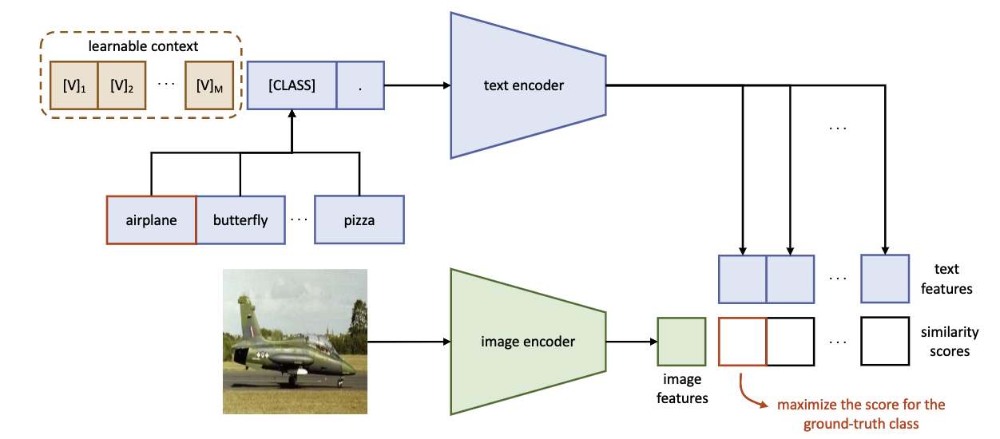

# CoOp

Context Optimazation

[Learning to Prompt for Vision-Language Models](https://arxiv.org/pdf/2109.01134.pdf)

## Unified Context

所有的类别使用相同的上下文

$$
t = [\mathbf{V}]_1[\mathbf{V}]_2...[\mathbf{V}]_M[\text{CLASS}]
$$

这里$[\mathbf{V}]_m$是embedding后的向量（512 in CLIP），M是超参数。

令g表示text encoder，每个类别的预测为

$$
p(y=i|x) = \frac{\exp(\cos(g(t_i),f)/\tau)}{\sum_{j=1}^K\exp(\cos(g(t_j),f)/\tau)}
$$

同样也能够把[CLASS]放在中间

$$
t = [\mathbf{V}]_1[\mathbf{V}]_2...[\mathbf{V}]_{\frac{M}{2}}[\text{CLASS}][\mathbf{V}]_{\frac{M}{2} + 1}...[\mathbf{V}]_{M}
$$

## Class-Specific Context

对于每个类别$i,j \in \{1,2,...,K\}$，

$$
[\mathbf{V}]_1^i[\mathbf{V}]_2^i...[\mathbf{V}]_M^i  \neq [\mathbf{V}]_1^j[\mathbf{V}]_2^j...[\mathbf{V}]_M^j ,i \neq j
$$

## Training

最小化交叉熵进行梯度反传
