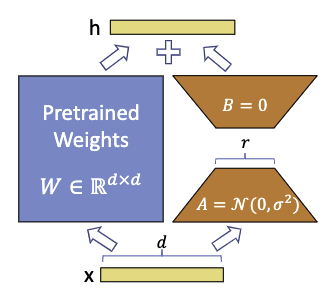

# LoRA

Low-Rank Adaptation of Large Language Models

[论文](https://arxiv.org/pdf/2106.09685.pdf)

## 主要方法

对于预训练好的模型的一个权重矩阵 $W_0 \in \mathbb{R}^{d \times k}$ ， 使用 $W_0 + \Delta W = W_0 + BA$ 其中 $B \in \mathbb{R}^{d \times r}$ ，$A \in \mathbb{R}^{r \times k}$ ， $r \ll \min(d,k)$。在训练过程中，$W_0$保持固定，$B A$是可学习的参数。对于 $h = W_0 x$ ，前递层变为

$$
h = W_0 x + BAx
$$

初始化$A$用高斯，初始化$B$为0矩阵，所以一开始$W_0$就是0。用$\frac{\alpha}{r}$缩放$\Delta Wx$ ，$\alpha$是常数，使用Adam优化器，调整为和初始学习率大致相同。

### 梯度计算

todo

### Apply to Transformer

在Self-Attention 模块中，对四个参数$W_q,W_k,W_v,W_o$进行上述
