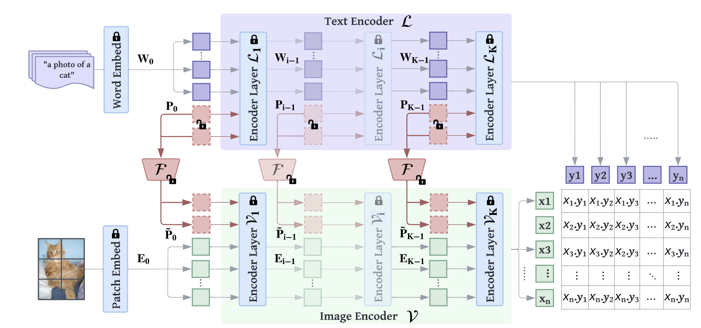

# MaPLe

[MaPLe: Multi-modal Prompt Learning](https://arxiv.org/abs/2210.03117)

[code](https://github.com/muzairkhattak/multimodal-prompt-learning/tree/main)

## 主要方法

### ViT based CLIP

#### Encoding image

$\{V_1,...V_K\}$表示K层transformer layer，图片首先被分成M个patch并embedding到$E_0 \in \mathbb{R}^{M \times d_v}$ ，contact一个CLS token $c_i$，进transformer层

$$
[c_i,E_i] = V_i([c_{i-1},E_{i-1}])  \ \ \ i = 1,...,K
$$

最后过一个ImageProj

$$
x = \text{ImageProj}(c_K)
$$

得到feature $x \in \mathbb{R}^{d_{vl}}$

#### Encoding text

将文本转化为token并进行word embedding 得到 $W_0 = [w_0^1,...,w_0^N] \in \mathbb{R}^{N \times d_l}$，过transformer

$$
[W_i] = L_i([W_{i-1}])
$$

最后取最后一个过线性层

$$
z = \text{TextProj}(w_K^N)
$$

得到文本表示$z \in \mathbb{R}^{d_{vl}}$

### MaPLe

总共K个transformer层的前J个层加可学习的tokens。

#### Deep Language Prompt

引入b个language prompt tokens $\{P^i_0 \in \mathbb{R}^{d_l}\}_{i=1}^{b}$ ，input embedding就变成 $[P^1_0,...,P^b_0,W_0]$ 。

前J个transformer层中

$$
[\_ , W_i] = L_i([P_{i-1},W_{i-1}]) \ \ \ i = 1,...,J
$$

后面的层

$$
[P_j , W_i] = L_i([P_{i-1},W_{i-1}]) \ \ \ i = J+1,...,K
$$

$$
z = \text{TextProj}(w_K^N)
$$

当$J=1$时就是CoOp。

#### Deep Vision Prompting

引入b个可学习的tokens $\{\tilde{P}^i_0 \in \mathbb{R}^{d_l}\}_{i=1}^{b}$

$$
[c_i,E_i,\_] = V_i([c_{i-1},E_{i-1},\tilde{P}_{i-1}])  \ \ \ i = 1,...,J
$$

$$
[c_i,E_i,\tilde{P}_i] = V_i([c_{i-1},E_{i-1},\tilde{P}_{i-1}])  \ \ \ i = J+1,...,K
$$

$$
x = \text{ImageProj}(c_K)
$$

#### Vision Language Prompt Coupling

对于$\tilde{P}_i$和$P_i$，设计coupling function
$\tilde{P}_i = F_i(P_i) ,i=1,...,J$，$F$是一个把$d_l$映射到$d_v$的线性层。
