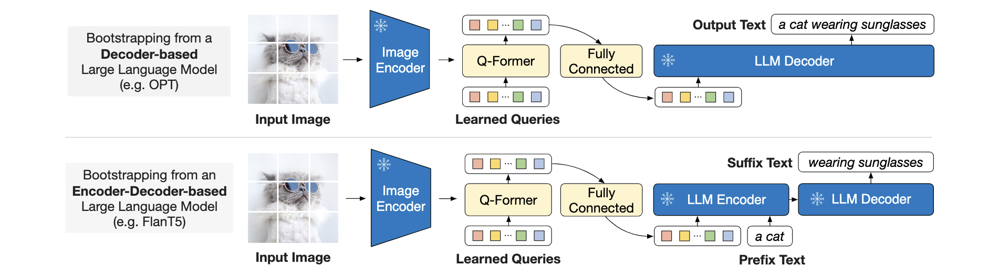

# BLIP-2

[Bootstrapping Language-Image Pre-training with Frozen Image Encoders and Large Language Models](https://arxiv.org/pdf/2301.12597)

[code](https://github.com/salesforce/BLIP)

## Q-Former

用一个冻结参数的image transformer作为图像编码器给q-former提供图像信息，一个text tranformer作为text encoder和decoder，self-attn的参数在q-former的两个子模块之间是共享的

在输入的文本embedding前加上32个可学习的token作为query，learned query过完self-attn后与image feature做cross-attn。

self-attn层根据训练任务不同使用不同的mask来控制他们的交互

## Bootstrap Vision-to-Language Generative Learning from a Frozen LLM

生成预训练阶段，将Q-Former（附带冻结图像编码器）连接到冻结LLM，以获取LLM的生成语言能力。使用全连接层把query的output投影到和LLM输入维度相同大小。

对于decoder-based的LLMs，根据Q-former得到的结果生成文本；对于encoder-decoder-based LLMs，把前缀文本和Q-former输出作为编码器的输入，后缀文本作为生成的目标
