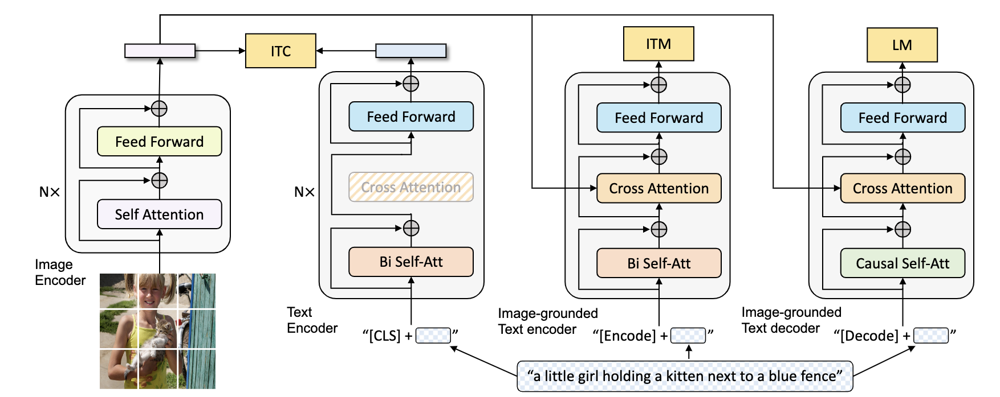
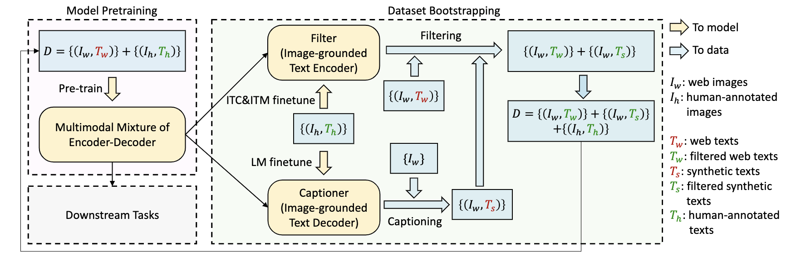

# BLIP

[Bootstrapping Language-Image Pre-training for Unified Vision-Language Understanding and Generation](https://arxiv.org/abs/2201.12086)

## 相关工作

- ALBEF

- VLMO

## Multimodal mixture of Encoder-Decoder

### Model Architecture

Image Encoder部分使用ViT进行编码

#### Unimodal encoder

分别编码Image和text，text部分类似于BERT，放一个[CLS] token在输入句子的开头作为语义信息的总结。

#### Image-grounded text encoder

通过在每个block的Self Attention和Feed Forward层之间加入 Cross Attention层来引入图像信息， 输入的句子开头有一个特定于任务的[Encode] token。

#### Image-grounded text decoder

用causal self-attention层（masked multihead-attn）取代前面的双向自注意力。输入的句子开头放一个[Decode] token，标志句子结束的token放到输入的末尾。

### Pre-training Objectives

把一个图像-文本对放到模型，图像过一个encoder，文本同时过一个encoder和decoder，来计算三个损失。

#### Image-Text Contrastive Loss (ITC)

对齐 visual transformer和text transformer的feature space(ALBEF中提出的loss)

#### Image-Text Matching Loss (ITM)

是一个二分类任务，其中模型使用 ITM 头（线性层）来预测图像-文本对在给定多模态特征的情况下是否匹配或不匹配

#### Language Modeling Loss (LM)

旨在生成给定图像的文本描述,将视觉信息转换成连贯的字幕，优化交叉熵损失，该损失训练模型以自回归方式最大化文本的可能性

### 模型细节

Text encoder和decoder共享除了self-attn层之外的所有参数，以提高训练效率。encoder使用双向自主意力做类似完形填空的任务，decoder使用因果自主意力预测下一个词

## CapFilt

$\{ (I_h,T_h) \}$ （COCO） 是人工标注的高质量图像文本对，$\{ (I_w,T_w) \}$ 是从网络上获取的大量未标注图像文本对，使用Captioning and Filtering来提高文本语料库的质量

用一个Captioner为图像生成文字，一个Filter来移除不匹配的图像文本对。Captioner和Filter都是从预训练的MED中得到的，然后在COCO数据集上进行微调。

**Captioner**是MED模型中的image-grounded text decoder，给定网络图像$I_w$， Captioner为图像合成字幕$T_s$

**Filter**是image-grounded text encoder，用 ITC and ITM 来学习图像和文本是否匹配，filter把原来网络上得到的文本 $T_w$ 和 合成的文本 $T_s$ 中不匹配的去掉（用ITM分类头），最后将过滤后的图像-文本对与人工注释对相结合，形成一个新的数据集，在预训练一个新的模型。
